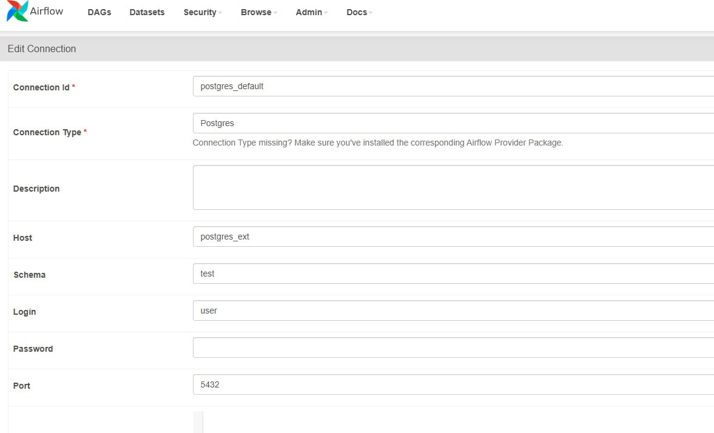

## Структура каталогов проекта

./dags - каталог для DAG

./data - исходные данные

./postgres/init/init.sql -  ddl для задания, выполняются при инициализации postgres


Dockerfile - образ apache/airflow:2.6.2 + установка openpyxl

docker-compose.yml - сервисы AF + postgres в качестве хранилища

Запуск контейнеров:

`docker-compose up -d`

`docker-compose up airflow-init`


Для работы Дага в AF нужно добавить подключение:




### Варианты запуска:

1. Загрузка по расписанию
    Ежедневный запуск, захват из источника в границах >= date_from AND < date_to, где date_from = MAX(sale_datetime) из stg или 2024-01-01,
    date_to = DAG run time (UTC)
2. Запуск с конфигом, например:

``{
    "date_from": "2024-03-01T00:00:00+00:00",
    "date_to": "2024-03-23T00:00:00+00:00"
}``


xls -> stg

Загрузка из источника согласно заданному интервалу (см. выше).

Перед загрузкой очищаем stg: удаляем всё за [date_from, date_to).

Добавляем поле load_date = now() и src_name = имя файла источника.

stg -> ods

загружаем только новые данные - где load_date из  stg больше чем максимальный  load_date в ods.
Для избежания записи дублей сравниваем хэш по строке. Если данные изменились, то перезаписываем, если не изменились, то пропускаем.

ods -> dm

аналогично, загружаем только новые данные из ods - где load_date из  ods больше чем максимальный  loaded_at в dm.

Уточнение по витрине dm.coffee_sales_daily: 

По заданию нужно вывести топ 1 час, в котором было продано больше кофе. Я вывела топ 1 по количеству. Для кейсов, где таких часов за день несколько вывела меньший час.

```
with 
    source_data as (
    select *
    FROM ods.coffee_sales_clean c1
     WHERE load_date > COALESCE((SELECT MAX(loaded_at) FROM dm.coffee_sales_daily csd ), '1970-01-01')
    ),
    
    agg_by_day as (
     select sale_date,
         sum(src.revenue_rub) as total_revenue_rub,
         avg(src.revenue_rub) as avg_check_rub,
         count(*) as total_units_sold  
     from source_data src
     group by sale_date 
    )
    ,
    
    agg_per_hour as ( 
     select sale_date, 
         hour_of_day,
         count(*) as amount_per_hour,
         sum(revenue_rub)  as revenue_per_hour
      from source_data 
      group by sale_date, hour_of_day
      
      ) ,
      
      max_amount_per_hour as (
      select sale_date,
          hour_of_day,
          amount_per_hour,
          row_number() over (partition by sale_date order by amount_per_hour desc ) as rn
      from 
      agg_per_hour
      )
      
      select abd.sale_date,
          total_revenue_rub, 
          avg_check_rub, 
          total_units_sold,
          hour_of_day as top_hour,
          amount_per_hour as top_hour_sales,
          now() as loaded_at
      from agg_by_day as abd
      left join (select * from max_amount_per_hour where rn = 1) as t
      on abd.sale_date = t.sale_date
      


